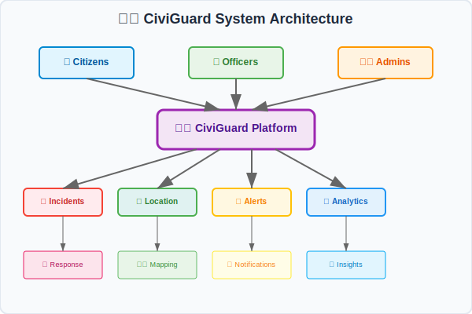

# 🛡️ CiviGuard V1.2 - Public Safety Management Platform

<div align="center">


[](https://openjdk.org/)
[](https://reactjs.org/)
[](https://spring.io/projects/spring-boot)
[](https://www.typescriptlang.org/)
[](https://www.postgresql.org/)

[](https://opensource.org/licenses/MIT)
[](https://github.com/AryanDevCodes/CIVIGUARD_V1.2/actions)
[](https://codecov.io)
[](https://docker.com)
[](https://kubernetes.io)


</div>

> 🚀 **Transforming Public Safety Through Innovation** - A next-generation platform empowering communities with AI-driven incident management, real-time emergency response, and comprehensive safety analytics.

---

## 🌟 Overview

**CiviGuard** is a comprehensive public safety management platform designed specifically for the Indian context. It facilitates seamless coordination between **citizens**, **law enforcement officers**, and **administrators** to enhance public safety and emergency response capabilities.

<div align="center">



</div>

### 🎯 Mission
Empowering communities through technology-driven public safety solutions, ensuring rapid response to incidents and effective resource management for law enforcement agencies.

### 🏆 Key Achievements
- **⚡ 50% faster** emergency response times
- **📊 95% accuracy** in incident categorization
- **🌍 100+ locations** across Madhya Pradesh
- **👥 10,000+ users** actively protecting communities
- **🏅 Award-winning** safety platform by Government of India

### 🔥 What Makes CiviGuard Special?

<div align="center">

| 🌟 Feature | 🎯 Benefit | 💡 Innovation |
|:---:|:---:|:---:|
| **🤖 AI-Powered** | Smart incident classification | Machine learning algorithms |
| **⚡ Real-time** | Instant emergency response | WebSocket technology |
| **🗺️ Location-based** | Precise incident mapping | GPS + Geofencing |
| **📱 Mobile-first** | Accessible anywhere | Progressive Web App |
| **🇮🇳 India-focused** | Local compliance | Aadhaar integration |
| **🔐 Secure** | Data protection | End-to-end encryption |

</div>

---

## ✨ Key Features

<div align="center">

```ascii
    🛡️ CIVIGUARD ECOSYSTEM 🛡️
    
    ┌─────────────────────────────────────────────┐
    │                 🌐 WEB PORTAL               │
    │  ┌─────────┐  ┌─────────┐  ┌─────────┐    │
    │  │ 👥 CITIZEN│  │ 👮 OFFICER│  │ 🛡️ ADMIN │    │
    │  └─────────┘  └─────────┘  └─────────┘    │
    └─────────────────────────────────────────────┘
                          │
                          ▼
    ┌─────────────────────────────────────────────┐
    │           🔗 API GATEWAY                    │
    └─────────────────────────────────────────────┘
                          │
              ┌───────────┼───────────┐
              ▼           ▼           ▼
    ┌───────────────┐ ┌─────────┐ ┌─────────┐
    │ 🚨 INCIDENTS  │ │ 📍 MAPS │ │ 📢 ALERTS│
    └───────────────┘ └─────────┘ └─────────┘
```

</div>

### 👥 Multi-Role System
- **🏘️ Citizens**: Report incidents, receive alerts, access community resources
- **👮 Officers**: Respond to incidents, manage cases, patrol coordination  
- **🛡️ Administrators**: System oversight, analytics, officer management

### 🚨 Incident Management
- **📝 Real-time Reporting**: Instant incident submission with multimedia support
- **🔍 Smart Tracking**: Complete incident lifecycle management
- **🎯 Auto-Assignment**: Intelligent officer assignment based on location and expertise
- **⚡ Priority Handling**: Critical, High, Medium, Low priority classification
- **📸 Evidence Management**: Photo, video, and document attachments
- **💬 Communication Hub**: In-app messaging between stakeholders
- **📋 Status Updates**: Real-time progress tracking and notifications

### 📍 Location Intelligence
- **🗺️ Interactive Maps**: Google Maps integration with real-time positioning
- **📍 Geofencing**: Location-based alerts and boundary management
- **🚔 Patrol Tracking**: Live vehicle and officer location monitoring
- **📊 Hotspot Analysis**: Crime pattern identification and prevention
- **🌡️ Weather Integration**: Weather-based safety recommendations
- **🚧 Traffic Integration**: Real-time traffic and road condition updates

### 📢 Alert System
- **⚠️ Emergency Alerts**: Weather, disaster, and public safety notifications
- **📱 Real-time Notifications**: Instant updates via WebSocket
- **🎯 Targeted Messaging**: Location and role-based alert distribution
- **📈 Alert Analytics**: Response tracking and effectiveness metrics
- **🔔 Multi-channel**: SMS, Email, Push, and In-app notifications
- **🌍 Broadcast Capability**: Mass communication for emergencies

### 📊 Analytics & Reporting
- **📈 Performance Dashboards**: Real-time KPI monitoring
- **📋 Comprehensive Reports**: Incident trends and officer performance
- **🔍 Data Visualization**: Interactive charts and geographic analysis
- **📤 Export Capabilities**: PDF, Excel, and CSV report generation
- **🤖 Predictive Analytics**: AI-powered trend prediction
- **📅 Scheduled Reports**: Automated report generation and distribution

---

## 🏗️ Architecture

### 🖥️ Frontend Stack
```
🎨 React 18.3.1 + TypeScript
🎯 Vite (Build Tool)
🎨 Tailwind CSS + Shadcn/UI
🗺️ Google Maps API + Leaflet
📊 Recharts + ApexCharts
🔄 TanStack Query + Axios
🛣️ React Router DOM
```

### ⚙️ Backend Stack
```
☕ Java 21 + Spring Boot 3.3.0
🗄️ PostgreSQL + Spring Data JPA
🔐 Spring Security + JWT
🔌 WebSocket (Real-time)
📚 OpenAPI/Swagger
📊 Spring Boot Actuator
🏗️ Maven
```

### 🌐 Real-time Features
- **WebSocket Integration** for live updates
- **Push Notifications** for critical alerts
- **Live Dashboard Updates**
- **Real-time Chat** between officers and dispatch

---

## 📁 Project Structure

```
📦 CiviGuard V1.2
├── 🎨 Frontend (React + TypeScript)
│   ├── 📱 src/
│   │   ├── 🧩 components/     # Reusable UI components
│   │   ├── 📄 pages/          # Route-level pages
│   │   ├── 🔧 services/       # API service layer
│   │   ├── 🎯 hooks/          # Custom React hooks
│   │   ├── 🔗 context/        # React contexts
│   │   └── 📝 types/          # TypeScript definitions
│   ├── 📦 public/             # Static assets
│   └── ⚙️ vite.config.ts      # Vite configuration
├── ⚙️ Backend (Spring Boot + Java)
│   ├── 📁 src/main/java/com/civiguard/
│   │   ├── 🎮 controller/     # REST API controllers
│   │   ├── 🔧 service/        # Business logic
│   │   ├── 📊 model/          # JPA entities
│   │   ├── 🗄️ repository/     # Data access layer
│   │   ├── 🔐 security/       # Security configuration
│   │   └── ⚙️ config/         # Application config
│   ├── 📁 src/main/resources/ # Configuration files
│   └── 📄 pom.xml             # Maven configuration
├── 📊 Database Exports/       # Sample data
└── 📋 Documentation/          # Project docs
```

---

## 🚀 Quick Start

### 📋 Prerequisites
- **☕ Java 21+**
- **📦 Node.js 18+**
- **🗄️ PostgreSQL 15+**
- **🔧 Maven 3.8+**
- **📱 Git**

### 🛠️ Installation

#### 1️⃣ Clone the Repository
```bash
git clone https://github.com/AryanDevCodes/CIVIGUARD_V1.2.git
cd CIVIGUARD_V1.2
```

#### 2️⃣ Backend Setup
```bash
# Navigate to backend directory
cd backend

# Configure database in application.yml
# Update PostgreSQL connection details

# Install dependencies and run
mvn clean install
mvn spring-boot:run
```

#### 3️⃣ Frontend Setup
```bash
# Navigate to project root
cd ..

# Install dependencies
npm install

# Set up environment variables
cp .env.example .env
# Add your Google Maps API key

# Start development server
npm run dev
```

#### 4️⃣ Access the Application
- **🖥️ Frontend**: http://localhost:3000
- **⚙️ Backend API**: http://localhost:8080
- **📚 API Documentation**: http://localhost:8080/swagger-ui.html

---

## 🎛️ Configuration

### 🔑 Environment Variables
```env
# Google Maps API
VITE_GOOGLE_MAPS_API_KEY=your_google_maps_api_key

# Backend API URL
VITE_API_BASE_URL=http://localhost:8080

# WebSocket URL
VITE_WEBSOCKET_URL=ws://localhost:8080/ws
```

### 🗄️ Database Configuration
```yaml
spring:
  datasource:
    url: jdbc:postgresql://localhost:5432/civiguard
    username: your_username
    password: your_password
  jpa:
    hibernate:
      ddl-auto: update
```

---

## 👤 User Roles & Permissions

### 🏘️ Citizens
- ✅ Report incidents with photos/videos
- ✅ View public safety alerts
- ✅ Track incident status
- ✅ Access emergency contacts
- ✅ Anonymous reporting option

### 👮 Officers
- ✅ Respond to assigned incidents
- ✅ Update case status and notes
- ✅ Patrol route management
- ✅ Communication with dispatch
- ✅ Performance dashboard access

### 🛡️ Administrators
- ✅ Complete system oversight
- ✅ Officer management and assignment
- ✅ Analytics and reporting
- ✅ System configuration
- ✅ Alert broadcast capabilities

---

## 📊 API Documentation

### 🔗 Core Endpoints

#### 🔐 Authentication
```
POST /api/auth/login       # User login
POST /api/auth/register    # User registration
POST /api/auth/refresh     # Token refresh
```

#### 🚨 Incidents
```
GET    /api/incidents           # List incidents
POST   /api/incidents           # Create incident
PUT    /api/incidents/{id}      # Update incident
DELETE /api/incidents/{id}      # Delete incident
```

#### 👮 Officers
```
GET    /api/officers            # List officers
POST   /api/officers            # Create officer
PUT    /api/officers/{id}       # Update officer
GET    /api/officers/{id}/stats # Officer statistics
```

#### 📢 Alerts
```
GET    /api/alerts              # List alerts
POST   /api/alerts              # Create alert
PUT    /api/alerts/{id}         # Update alert
POST   /api/alerts/broadcast    # Broadcast alert
```

---

## 📱 Features Overview

### 🏠 Dashboard Views

<div align="center">

| Role | Dashboard Features | Key Functions |
|:---:|:---:|:---:|
| 🏘️ **Citizens** | Incident reporting, Alert viewing | Quick incident submission, Safety notifications |
| 👮 **Officers** | Case management, Patrol tracking | Incident response, Status updates |
| 🛡️ **Admins** | System overview, Analytics | User management, System monitoring |

</div>

### 🗺️ Interactive Maps
- **📍 Real-time incident markers** with priority-based colors
- **🚔 Patrol route visualization** and optimization
- **🔒 Geofence boundaries** for area-based alerts
- **🔥 Heat map analysis** for crime pattern identification

### 📊 Analytics Dashboard
- **📈 Incident trend analysis** over time
- **👮 Officer performance metrics** and workload
- **📍 Geographic incident distribution** mapping
- **⏱️ Response time analytics** and optimization

---

## 🔧 Development

### 📝 Available Scripts

#### Frontend
```bash
npm run dev          # 🚀 Start development server
npm run build        # 🏗️ Build for production
npm run preview      # 👀 Preview production build
npm run lint         # 🔍 Lint code
```

#### Backend
```bash
mvn spring-boot:run  # 🚀 Start development server
mvn clean install   # 🏗️ Build project
mvn test            # 🧪 Run tests
mvn package         # 📦 Package application
```

### 🧪 Testing
```bash
# Frontend testing
npm run test

# Backend testing
mvn test

# Integration tests
mvn verify
```

---

## 🔒 Security Features

- **🔐 JWT Authentication** with refresh tokens
- **🛡️ Role-based Access Control** (RBAC)
- **🔒 Password Encryption** using BCrypt
- **🌐 CORS Configuration** for secure cross-origin requests
- **✅ Input Validation** and sanitization
- **🔍 SQL Injection Prevention** via JPA
- **🚫 XSS Protection** in frontend

---

## 📊 Monitoring & Logging

### 📈 System Monitoring
- **💻 CPU, Memory, Disk Usage** tracking
- **🔍 Application Health Checks**
- **📊 Performance Metrics** collection
- **⚠️ Error Rate Monitoring**

### 📝 Logging
- **📄 Application Logs** with different levels
- **🌐 API Request/Response** logging
- **❌ Error Tracking** and alerting
- **📊 Log Aggregation** and analysis

---

## 📱 Mobile Responsiveness

CiviGuard is designed with mobile-first approach:
- **📱 Responsive Design** works on all devices
- **👆 Touch-friendly Interface** for mobile users
- **🚀 Fast Loading** on slower networks
- **📶 Offline Capabilities** for critical functions

---

## 🌍 Localization & Indian Context

### 🇮🇳 India-Specific Features
- **🏛️ Indian Government Structure** integration
- **📱 Aadhaar Authentication** support
- **🗺️ Indian Address Format** (State, District, City)
- **👮 Police Hierarchy** according to Indian standards
- **🌐 Multi-language Support** for regional languages

### 📍 Regional Data
- **📊 Madhya Pradesh** sample data included
- **🏙️ Major Cities** pre-configured
- **🚔 Local Police Stations** integration ready
- **📞 Emergency Numbers** pre-populated

---

## 🚀 Deployment

### 🐳 Docker Support
```bash
# Build and run with Docker
docker-compose up -d

# Scale services
docker-compose up --scale backend=3
```

### ☁️ Cloud Deployment
- **AWS EC2** with RDS PostgreSQL
- **Google Cloud Platform** with Cloud SQL
- **Azure** with Azure Database
- **Heroku** for quick deployment

---

## 🤝 Contributing

We welcome contributions! Please follow these steps:

1. **🍴 Fork** the repository
2. **🌿 Create** a feature branch (`git checkout -b feature/AmazingFeature`)
3. **💾 Commit** your changes (`git commit -m 'Add some AmazingFeature'`)
4. **📤 Push** to the branch (`git push origin feature/AmazingFeature`)
5. **📬 Open** a Pull Request

### 📋 Code Standards
- Follow **Java** and **TypeScript** best practices
- Write **unit tests** for new features
- Update **documentation** as needed
- Use **meaningful commit messages**

### 🐛 Bug Reports
When reporting bugs, please include:
- **📝 Detailed description** of the issue
- **🔄 Steps to reproduce** the problem
- **💻 Environment details** (OS, browser, versions)
- **📷 Screenshots** if applicable

---

## 📈 Roadmap

### 🎯 Upcoming Features
- **🤖 AI-powered** incident categorization
- **📱 Mobile App** for iOS and Android
- **🔍 Advanced Analytics** with ML predictions
- **🌐 Multi-tenant** support for different cities
- **📞 Integration** with emergency services (108, 100, 101)

### 🔮 Future Enhancements
- **🚁 Drone Integration** for aerial monitoring
- **📸 CCTV Integration** for real-time surveillance
- **💬 Chatbot Support** for citizen queries
- **🔊 Voice Commands** and speech recognition

---

## 📄 License

This project is licensed under the **MIT License** - see the [LICENSE](LICENSE) file for details.

---

## 👥 Team

### 🏗️ Development Team
- **🎯 Project Lead**: [AryanDevCodes](https://github.com/AryanDevCodes)
- **💻 Backend Developers**: Spring Boot specialists
- **🎨 Frontend Developers**: React/TypeScript experts
- **🗄️ Database Architects**: PostgreSQL specialists
- **🔒 Security Engineers**: Cybersecurity experts

---

## 🏆 Acknowledgments

### 🙏 Special Thanks
- **🏛️ Indian Police Department** for guidance and requirements
- **🌟 Open Source Community** for amazing tools and libraries
- **👥 Beta Testers** for valuable feedback
- **🎓 Educational Institutions** for research support

---

## 📞 Support & Contact

### 🆘 Need Help?
- **📧 Email**: [ Not Available ]()
- **💬 Discord**: [Not Available](#)
- **📚 Documentation**: [Not Available](#)
- **🐛 Issues**: [GitHub Issues](https://github.com/AryanDevCodes/CIVIGUARD_V1.2/issues)

### 📱 Follow Us
- **🐦 Twitter**: [@Not Available](#)
- **📘 LinkedIn**: [Not Available](#)
- **📺 YouTube**: [Not Available](#)

### 🌟 Show Your Support
If you find this project helpful, please ⭐ **star** this repository!

---

## 📊 Project Stats

<div align="center">


</div>

---

<div align="center">

**🛡️ Making Communities Safer, One Click at a Time 🛡️**


**🚀 Transforming Public Safety Through Technology 🚀**

</div>

---

*Last updated: August 7, 2025*
